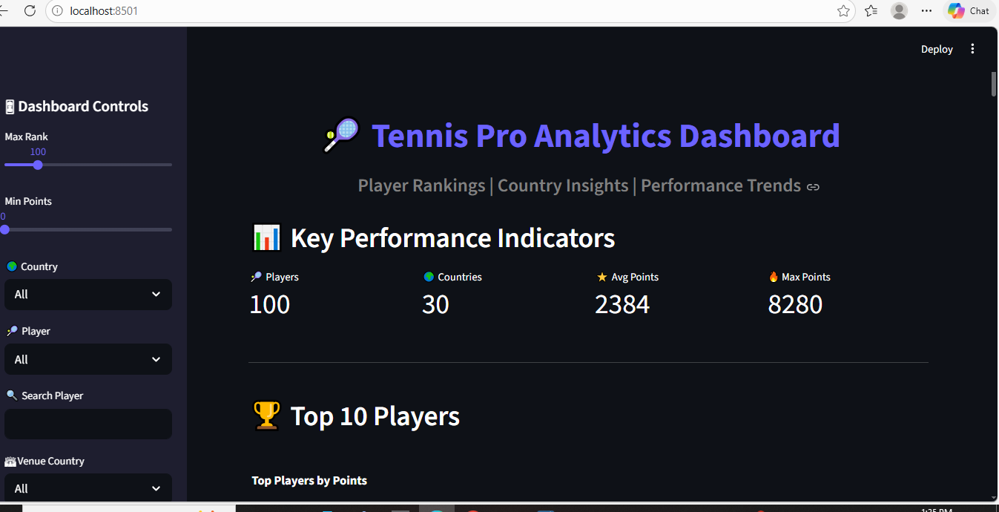
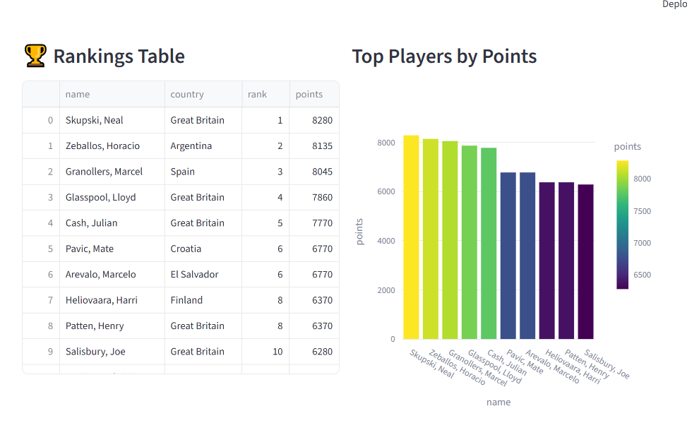
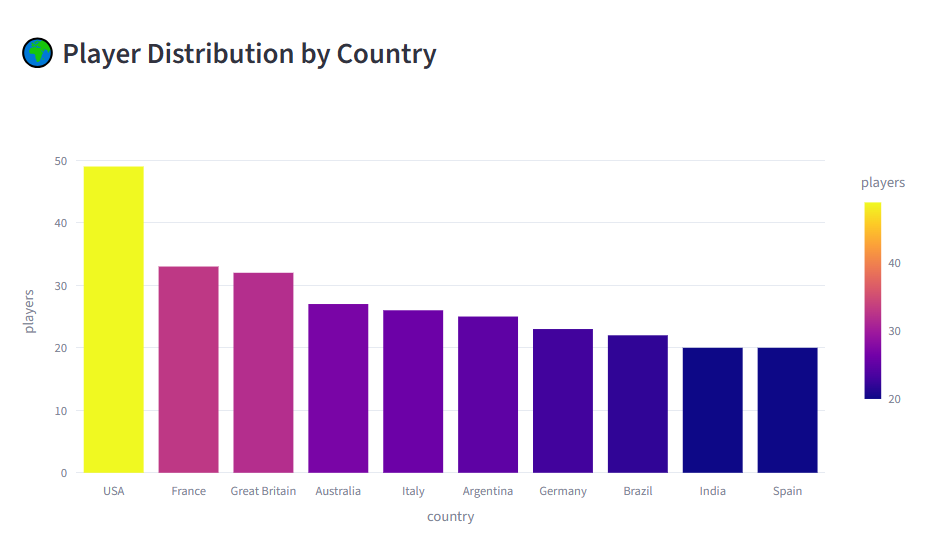
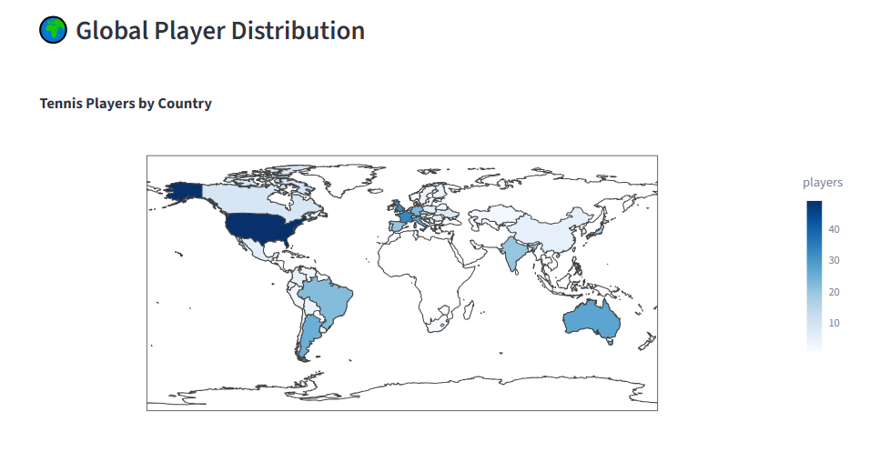
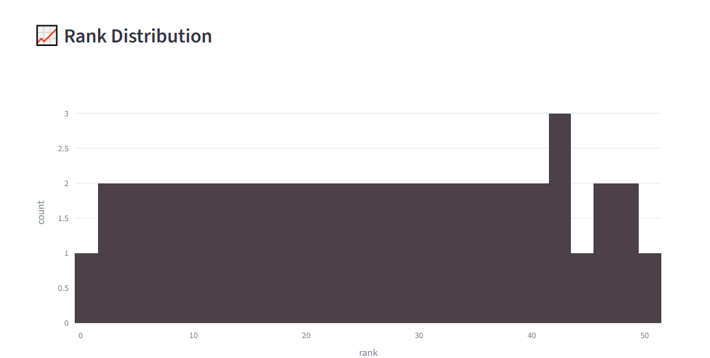

# Tennis-analytics-dashboard
Tennis analytics dashboard using SportRadar API, PostgreSQL, SQL and Stream lit.
The dashboard allows users to explore player rankings, distributions, and insights through interactive visualizations.

Technologies Used 
| Technology | Purpose                            |
| ---------- | ---------------------------------- |
| Python     | Data extraction and transformation |
| PostgreSQL | Database storage                   |
| SQLAlchemy | Database connection                |
| Pandas     | Data processing                    |
| Streamlit  | Interactive dashboard              |
| Plotly     | Data visualization                 |

API Data Extraction

The project retrieves tennis competition data using the SportRadar API.
Python's requests library is used to fetch JSON responses which are then processed and converted into structured tables.

response = requests.get(base_url + endpoint, headers=headers)
competitions = response.json()

Database Design

The extracted data is stored in PostgreSQL using relational tables:
categories
competitions
complexes
venues
competitors
competitor_rankings

SQL Analysis:
Several SQL queries were used to analyze the data:
Retrieve competitor rankings
Find top ranked players
Identify players with stable rankings
Analyze country-wise competitor distribution
Calculate total points per country

SELECT c.name, r.rank, r.points
FROM competitors c
JOIN competitor_rankings r
ON c.competitor_id = r.competitor_id
ORDER BY r.rank;

## Dashboard Screenshots

### Overall Dashboard

### Player Ranking

### Player Distribution

### Global Player Distribution

### Overall Distribution

